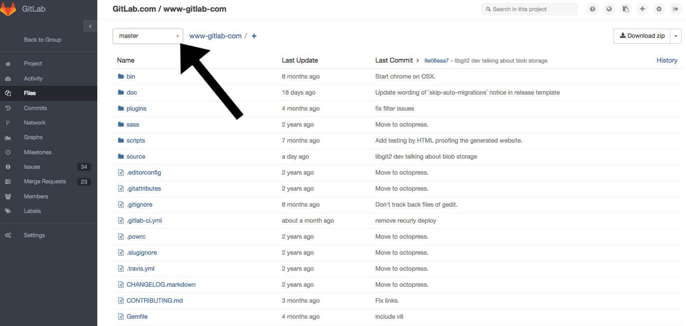

# How to add yourself to GitLab’s team page

Welcome to GitLab! We are happy to have you join our company and to include
you in our [team page](https://about.gitlab.com/team/). The following are
the steps to add yourself to the team page. Please follow the links that will guide you to full guides about every step.

1. Create an account in [GitLab.com](https://gitlab.com/) and take notes of
your username and password, because you will need them throughout these steps.

2. Ask your manager to grant you access to the [www-gitlab-com
project](https://gitlab.com/gitlab-com/www-gitlab-com).

3. Download Git, following the [start using git
documentation](http://doc.gitlab.com/ce/gitlab-basics/start-using-git.html)
. Don't forget to add your Git username and to set your email.

4. Follow the steps to create and add your [SSH
keys](http://doc.gitlab.com/ce/gitlab-basics/create-your-ssh-keys.html).

Note: in some of these steps, your
[shell](http://doc.gitlab.com/ce/gitlab-basics/start-using-git.html) will
require you to add your GitLab.com username and password.

4. Clone the www-gitlab-com project through your shell, following the [command
line commands
documentation](http://doc.gitlab.com/ce/gitlab-basics/command-line-commands.html).

5. Find the picture that you’d like to add to
our [team page](https://about.gitlab.com/team/), change the picture's name to
the following format: `yourname.jpg` or `yourname.png` and then follow the
"[how
to add an image](http://doc.gitlab.com/ce/gitlab-basics/add-image.html)"
steps.  

Note: Any picture that you provide will be made black-and-white
automatically after you add it, but it must be square. Note that your team
page picture should be added to
www-gitlab-com/source/images/team/NAME-OF-PERSON-IN-LOWERCASE.jpg.

6. [Create a Merge Request](http://doc.gitlab.com/ce/gitlab-basics/add-merge-request.html) in [GitLab.com](https://gitlab.com/) with the branch that you created with your picture.

7. In [GitLab.com](https://gitlab.com/), on the left side of your screen, click on "Files".

8. Find the dropdown menu at the top of your screen and find the branch
that you previously created to add your picture (they are in alphabetical
order). If you don't have a branch yet, follow the steps to [create a new
branch](http://doc.gitlab.com/ce/gitlab-basics/create-branch.html).


9. Information displayed on [Team page](https://about.gitlab.com/team/) is
pulled from a data file. You can find it by clicking on each of the following items: `data/``
`team.yml`.

10. When you are in “team.yml”, click on “edit” on the top right side of
your screen.

11. Your information should be added after the last person on the team page.
You need to copy and paste the following format and fill in your own
information:

```
- name: Linus Torvalds
  role: developer
  picture: picture_linus.jpg
  twitter: Linus_Torvalds
  gitlab: linustorvalds
  story:  |
          Linus was the principal force behind the development of the Linux
          kernel that became the most popular kernel for operating systems.
          He later became the chief architect of the Linux kernel and now
          acts as the project's coordinator. He also created the
          distributed revision control system git. He joined when it was
          created.
```
Don't forget to use other team members' information as a reference and to
respect the spaces between lines. Please don't use "tab" because it will break the page format.

12. After you added your information, add a comment to your commit and click
on “Commit Changes”.

13. Go to the Merge
Request that you previously created with the branch that you are using and
assign it to your manager for review.
