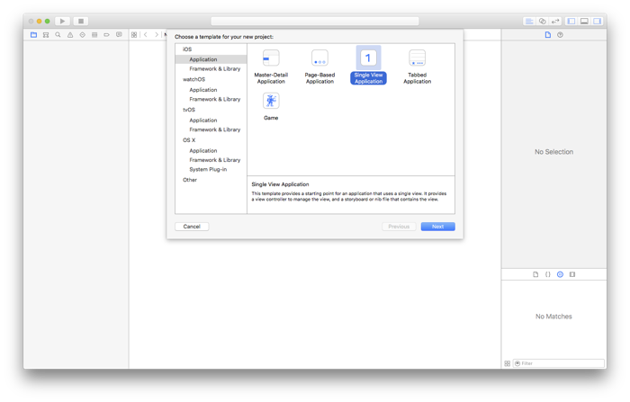

# Why CI?

[Continuous integration]() is a thing. More TK.

In a nutshell, here's what happens:

1. You push a commit to GitLab.
2. GitLab recognizes that the codebase has changed.
3. GitLab triggers a build with the GitLab Runner you set up on your Mac for the project.
4. The GitLab Runner runs through the build and test process you specified in `.gitlab-runner.yml`.
5. The GitLab Runner reports its results back to GitLab.
6. GitLab shows you the results of the build.

# Assumptions and environment

This post will provide a step-by-step guide to setting up GitLab CI for your iOS projects, from start to finish. First, however, we need to make a few assumptions.

[GitLab's strategy document](https://about.gitlab.com/strategy/) hinges on one key idea: *everyone can contribute*. As such, this post is written for readers of nearly all levels of experience. However, given that CI is a relatively advanced topic, we're going to assume some basic knowledge of how to create Xcode and GitLab projects, as well as some familiarity with Terminal and git.

This post was written with the following development environment in mind:

- A Mac running OS X 10.11.3 "El Capitan"
- Xcode 7.2.1 and the iOS 9.2 SDK
- GitLab.com v8.5

We'll also assume you've already created a new GitLab project. If you haven't, go ahead and do that now.

# Setting up your Xcode project

We'll start by creating a new single-view iOS project in Xcode.



Give your project a name and make certain that the **Include Unit Tests** and **Include UI Tests** options are enabled for the project. Xcode will create a template test class with some sample tests, which we'll use in this post as the test suite that GitLab CI runs to verify a build. Choose a name for your project and click on **Next**.


Choose where you'll save your iOS project. If you like, let Xcode create the git repository on your Mac.


Once Xcode has created and opened your iOS project, you need to [share its scheme](https://developer.apple.com/library/ios/recipes/xcode_help-scheme_editor/Articles/SchemeShare.html). Apple's [documentation](https://developer.apple.com/library/ios/recipes/xcode_help-scheme_editor/Articles/SchemeDialog.html) defines schemes nicely:

> A scheme is a collection of settings that specify which targets to build, what build configuration to use, and the executable environment to use when the product specified by the target is launched.

By sharing your scheme, GitLab CI gets context it needs to build and test your project.

To share a scheme in Xcode, choose **Product** > **Scheme** > **Manage Schemes**.


Click on the **Close** button.

Your Xcode project has been created with two test files; one includes sample unit tests, and the other includes sample UI tests. You can run **Product** > **Test** to run these tests, which will build your project, launch the Simulator, install the project on the Simulator device, and run the test suite. You can see the results right in Xcode:


The green checkmarks next to the test functions (both in the file, and in the Test navigator) show that all tests passed. We won't be referring to the Xcode project anymore, so if you like, you can close it.

Next, open Terminal and navigate to the folder you created for your iOS project.

It's convenient to add a standard `.gitignore` file. For a Swift project, enter

```
$ curl -o .gitignore https://www.gitignore.io/api/swift
```

For an Objective-C project, enter

```
$ curl -o .gitignore https://www.gitignore.io/api/objective-c
```

The `curl` command conveniently downloads the contents of the page at the given [gitignore.io](https://gitignore.io) URL into a file named `.gitignore`.

If Xcode initialized the git repository for you, you'll need to set the origin url to your GitLab project (replaceing `<username>` with your GitLab username and `<project>` with the project name:

```
$ git remote add origin git@gitlab.com:<username>/<project>.git
```

The final step here is to [install xcpretty](https://github.com/supermarin/xcpretty). When Xcode builds and tests your project, xcpretty will transform it into something more readable for you.

# Installing and registering the GitLab Runner

The GitLab Runner is a service that's installed on your Mac, which runs the build and test process that you set up in a configuration file. You can follow the [installation instructions for OS X](https://gitlab.com/gitlab-org/gitlab-ci-multi-runner/blob/master/docs/install/osx.md), but we'll need to make some changes to the *register the runner* step:

```
$ gitlab-ci-multi-runner register
WARNING: Running in user-mode.                     
WARNING: The user-mode requires you to manually start builds processing: 
WARNING: $ gitlab-runner run                       
WARNING: Use sudo for system-mode:                 
WARNING: $ sudo gitlab-runner...                   
```

If you're using self-hosted GitLab, the coordinator URL will be `http(s)://url-of-your-gitlab-instance/ci`.

```
Please enter the gitlab-ci coordinator URL (e.g. https://gitlab.com/ci):
https://gitlab.com/ci
```

The CI token for your project is available on GitLab's Project Settings page, under *Advanced Settings*. Each project has a unique token, so it won't be the same as the one below.

```
Please enter the gitlab-ci token for this runner:
s8BgtktbFwvdyxp1yyWZ
```

The `register` process suggests the name of your Mac as a description for the runner. You can enter something different if you like, or just hit **return** to continue.

```
Please enter the gitlab-ci description for this runner:
[Your-Mac's-Name.local]:
```

Enter whatever tags you'd like to further identify this particular runner.

```
Please enter the gitlab-ci tags for this runner (comma separated):
gitlab-ci-for-ios
```

The GitLab Runner will register the runner and give it a unique `runner` ID.

```
Registering runner... succeeded                     runner=s8Bgtktb
```


```
Please enter the executor: virtualbox, ssh, shell, parallels, docker, docker-ssh:
shell
Runner registered successfully. Feel free to start it, but if it's running already the config should be automatically reloaded! 
```


TK.

# Setting up your GitLab project for CI

TK.

# How to trigger builds

TK.

# How to stop/resume the runner, and what it does

TK.

# Other salient points

TK.