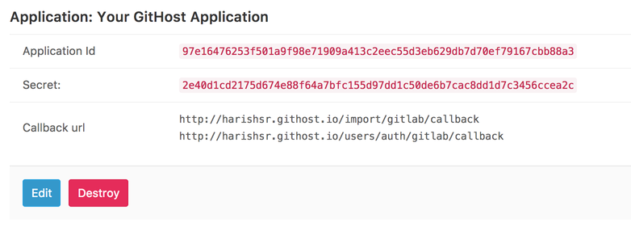
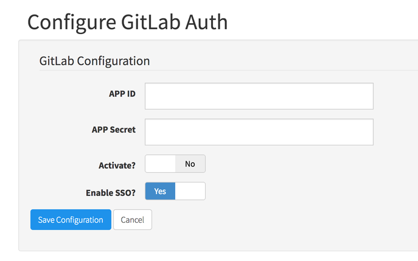

## On this page
{:.no_toc}

- TOC
{:toc}

----

## Migrate from GitLab.com

### Overview

You can move your existing projects from gitlab.com to your new GitHost.io instance. First you must enable the GitLab.com OmniAuth provider by registering your application with GitLab.com. GitLab.com will then generate an application ID and secret key for you to use. Then you would add this application ID and secret key to your GitHost instance before being able to import your projects.

### Enable your GitHost application in GitLab.com

- On GitLab.com, go to your [Applications page](https://gitlab.com/profile/applications) to add a New Application.
- Provide the required details:
  - Name: This can be anything. Consider something like <Organization>'s GitLab or <Your Name>'s GitLab or something else descriptive.
  - Redirect URI:
    ```
    http://your-instance.githost.io/import/gitlab/callback
    http://your-instance.githost.io/users/auth/gitlab/callback
    ```
    The first link is required for the importer and second for the authorization.
- Hit 'Submit'
- You should now see a Client ID and Client Secret near the top of the page (see screenshot). Keep this page open as you continue this process.
  

### Add the secret data to GitHost.io

<<< INCOMPLETE!
- Go to the GitHost Admin page for your instance.
- Add the Application ID and Client Secret to this instance:
  
- Click 'Save Configuration'
- Log in to your GitHost instance and click 'Import All'
