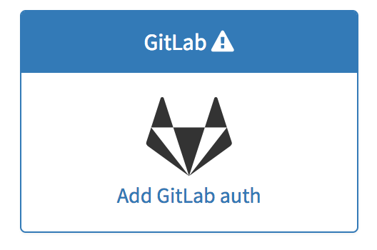

## On this page
{:.no_toc}

- TOC
{:toc}

----

## Migrate from GitLab.com

### Overview

You can move your existing projects from GitLab.com to your new GitHost.io instance. First you must open your GitLab account to a connection from your GitHost instance before giving that GitHost instance the keys to that connection. Once they are properly connected you can import one or all of your projects.

### Enable your GitHost application in GitLab.com

- On GitLab.com, go to your [Applications page](https://gitlab.com/profile/applications) to add a New Application.
- Provide the required details:
  - Name: This can be anything. Consider something like "MyOrganization's GitLab" or "YourName's GitLab" or something else descriptive.
  - Redirect URI:
    ```
    http://your-instance.githost.io/import/gitlab/callback
    http://your-instance.githost.io/users/auth/gitlab/callback
    ```
    The first link is required for the importer and second for the authorization.
  - Select the scopes to use (if any)
- Click 'Submit'
- You should now see a Client ID and Client Secret near the top of the page (see screenshot). Keep this page open as you continue this process.
  

### Add the secret data to GitHost.io

- Go to [GitHost](https://githost.io/)
- Find your instance and click on 'Details'
- Under 'OmniAuth Providers' on the right, click on 'Add GitLab auth':
  
- Add the Application ID and Client Secret to this instance:
  
- Select 'Activate'
- Click 'Save Configuration'
- If you have any arguments, such as 'scope':
  - Click on 'Edit' in the GitLab box
  - Add the 'Arguments':
  ```
  { scope: 'api' }
  ```
  - Click 'Save Configuration'
- You'll now be on the 'Details' page again.  On the left, under 'Actions',
  click on 'Reconfigure'.

### Import

- Go to your GitLab instance and try to create a new project
- Under 'Import project from' click 'GitLab.com'
- You will be taken to a page asking for permission to authorize GitLab.com.
  Click on 'Authorize'
- You will then see a list of your projects on GitLab.com.  Select 'Import
  all projects'
