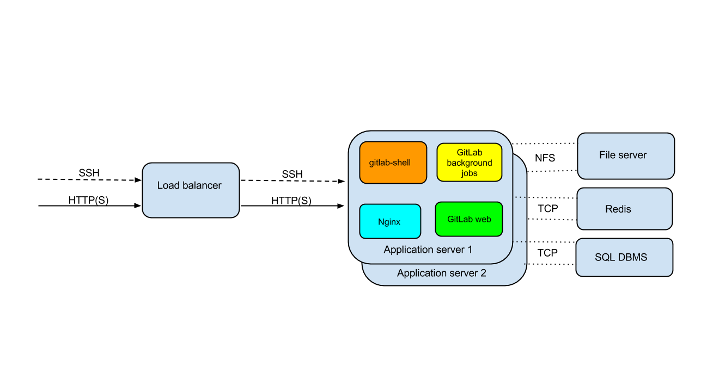

### What is High Availability?

High availability is a system design that ensures a prearranged level of operational performance throughout a specific time-period. The most common way to measure HA is through the notion of uptime, which measures how long a service is up and running.

GitLab provides a service that is usually essential to most organizations: it enables people to collaborate on code in a timely fashion. Any downtime should therefore be short and planned. Luckily, GitLab provides a solid setup even on a single server without special measures. And because of the distributed nature of git developers can still commit code locally even when GitLab is not available. However, some GitLab features such as the issue tracker and Continuous Integration are not available when GitLab is down.

**Keep in mind that all High Availability solutions come with a trade-off between cost/complexity and uptime**. The more uptime you want, the more complex the solution. And the more complex the solution, the more work is involved in setting up and maintaining it. High availability is not free and every HA solution should balance the costs against the benefits.

### High Availability for you

The two questions that you need to ask yourself are:

1.  What are my specific needs for code availability?
2.  What complexity level can my organization handle?

HA solutions range from a cheap and simple back-up to highly complex and costly master-master configurations. When it comes to HA, there is unfortunately no way to split between an increase in complexity and an increase in cost.

We recommend that you thoroughly analyze the benefits of an HA solution against its costs. Most organizations select a High Availability solution for GitLab that is less complex than the one they use for their primary customer-facing infrastructure that directly generates revenue. **It is important that you always choose something that you have experience with and will test regularly**. A badly implemented HA solution causes more downtime than it solves. For example the [DRBD user guide](http://www.drbd.org/users-guide/s-gfs-create-resource.html) states: "By configuring auto-recovery policies, you are effectively configuring automatic data-loss!". It is more cost effective to go from a simple solution to a more complex one than the other way around. Therefore, we suggest you work your way up from the simplest solution and see what works best for you.

**Zero downtime upgrades (including 'rolling' upgrades on a cluster)** can be achieved with any of the following configurations if there are no database schema changes that require the node(s) to be shut down. If there are database changes that are not backwards compatible then a live or rolling upgrade is not possible. Database changes are noted in the Upgrade Barometer of each release blog post.

### Maturity levels

#### 1\. Backup of files and Database

It is possible to automatically backup the GitLab repositories, configuration, and the database. You can manage backups with the [GitLab backup tasks](https://github.com/gitlabhq/gitlabhq/blob/master/lib/tasks/gitlab/backup.rake): create a backup with `rake gitlab:backup:create` and restore it with `rake gitlab:backup:restore`. In case the server becomes unavailable, then the backup can be used to restore the GitLab installation. This solution is appropriate for teams that have a single metal server at their disposal. **We recommend you store the backup at an external location. Also we recommend automating the backup task and monitoring successful completion.**

#### 2\. Recovery from snapshot

It is possible to create a snapshot of your working server. The snapshot is a copy of all the files on the server, and is taken periodically. In case of failure, the server is manually reverted to the latest available snapshot. If a secondary location is available, then it is possible to automatically revert to the snapshot, without the need for human intervention.

It is common to do this with virtual machines; most providers have functionality for taking snapshots. However it is also possible to use the XFS filesystem to take snapshots.

Recovering from a snapshot is faster than recovering from a backup as described above. In the latter case, you’d commonly need to re-install GitLab, manually restore any customization, and only then then run `rake gitlab:backup:restore`. Restoring from a snapshot skips these extra manual steps.

If you use the snapshot to restore the GitLab server to another machine one should consider the IP address implications. To make sure everyone can quickly use the new server it is common to update the DNS entry. In this case either the new machine has to use a new IP address, or the snapshot should use the same OpenSSH server certificate as the server it is replacing. Otherwise users accessing GitLab using the Git client over SSH will see “WARNING: REMOTE HOST IDENTIFICATION HAS CHANGED”, because the server certificate and the IP address of the GitLab server do not match.

The IP address mismatch issue can be resolved by using a floating IP, which is IP failover in a router, but has to be supported both by the router device and the network. If the new address is in a secondary geographical location, both locations need to be on the same network and have the same core router.

**Using recovery from snapshots is best suited for single virtual servers.**

#### 3\. Multiple application servers

It is possible to create a split between the application server, the file system and the DBMS. If resources are available, you can use a load balancer to assign tasks to multiple application servers. This way, if one of the application servers fails, the workflow is not interrupted, and at most the workflow gets slower as the load is shared between less machines.

The setup is described in the below picture.

This solution also requires a shared file system (NFS), so it is only available for GitLab versions 6.0 and up, where satellites are in the shared disk. At this point, you should consider putting the filestore and DBMS on separate machines as well. Moreover, the filestore and the DBMS will need recovery protocols on their own (through snapshots or backups)

#### 4\. Single slave server

**If you only want to use two machines for your HA solution, we recommend keeping one as a slave of the other.** In this situation, each machine has the full GitLab repositories, configuration, and the database. The slave server is a copy of the master. You can use Distributed Replicated Block Device (DRBD) to ensure that all data from the master is replicated to the slave in a timely manner.

Manual failover is done by mounting the file storage on the slave, which is turned into a master. At this point, the unavailable server should be turned off or taken off the network, to avoid it coming online with master status.

This option is feasible both for users who want to keep their slave server in the same data center, or if they want it in a different geographical location.

#### 5\. Filestore and DBMS slave servers

**It is not possible to combine the multiple application servers solution with a single slave server.** In this situation you need to have a second site with multiple stateless application servers and a filestore and DBMS slave server.

In this situation, users still connect via the load balanced application servers, but the filestore and the DBMS are copied to a slave server(s) in the same datacenter or in another location. Distributed Replicated Block Device (DRBD) can be used to pass data from the master filestore and DBMS servers to the slaves.

There is very little state on the application server in GitLab, so we don’t recommend having a slave application server alongside the filestore and the DBMS. Using a load balancer results in the same workflow impact, but in a more simple manner.

Automated failover can be achieved with pacemaker alongside STONITH network management. Keep in mind that application servers need to be prepared for transitioning to the new network addresses.

In this situation you can also opt to synchronize the database via a database specific protocol instead of DRBD, in the documentation for each database you can find out more about the [options for MySQL](http://dev.mysql.com/doc/mysql-ha-scalability/en/ha-overview.html) and the [options PostgreSQL](http://www.postgresql.org/docs/9.2/static/high-availability.html).

#### 6\. GitLab RE (unreleased)

We're in the planning stage of making GitLab RE for a geographically distributed GitLab. This will consist of a master server that runs GitLab EE. You can add slave servers with GitLab RE where you can only read git repos. This is for example useful when you have a large number of people or CI tools cloning repos and your wide area network (WAN) doesn't have the capacity or availability for this. This product is not available yet. It will likely require a plus subscription to use. Please contact our sales people for more information. For now please consider the following workarounds:

*   If you just need to be able to push to multiple GitLab servers in different locations, you should consider using git remotes.
*   Use the community made [GitLab mirror](https://github.com/samrocketman/gitlab-mirrors) to mirror repos.

#### Please get in touch

Supporting High Availabily setups is something we take very serious at GitLab.com. The information we provide here is just a rough guide designed to help you get a feel of the hardware, software and process implications of different HA setups. When it comes to your specific situation, we prefer to assess it in its context. We strongly suggest you get in touch with us before setting it up. Support for HA is included with [Premium Support](https://about.gitlab.com/pricing/). If you have any questions please [email us](mailto:sales@gitlab.com).
